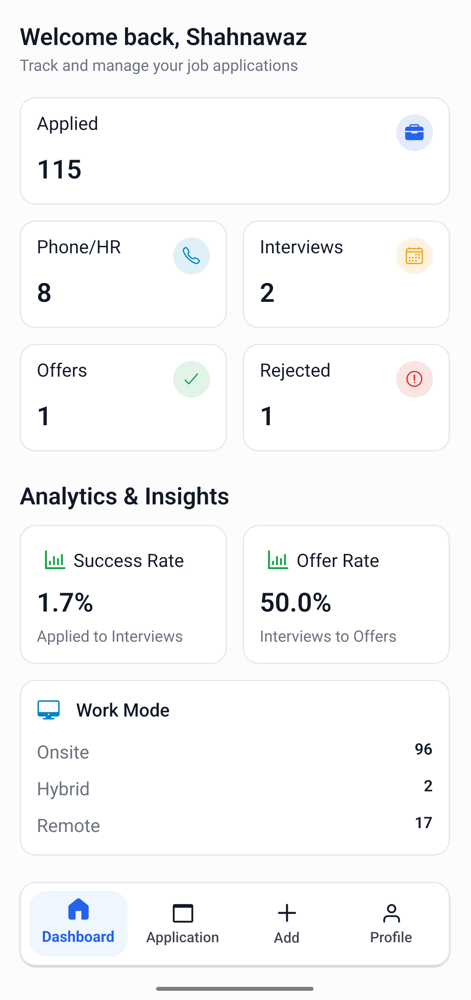
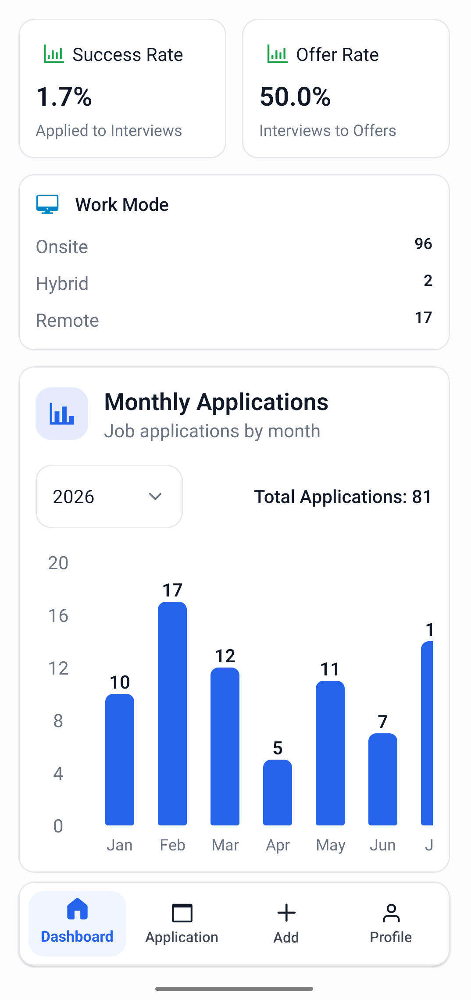
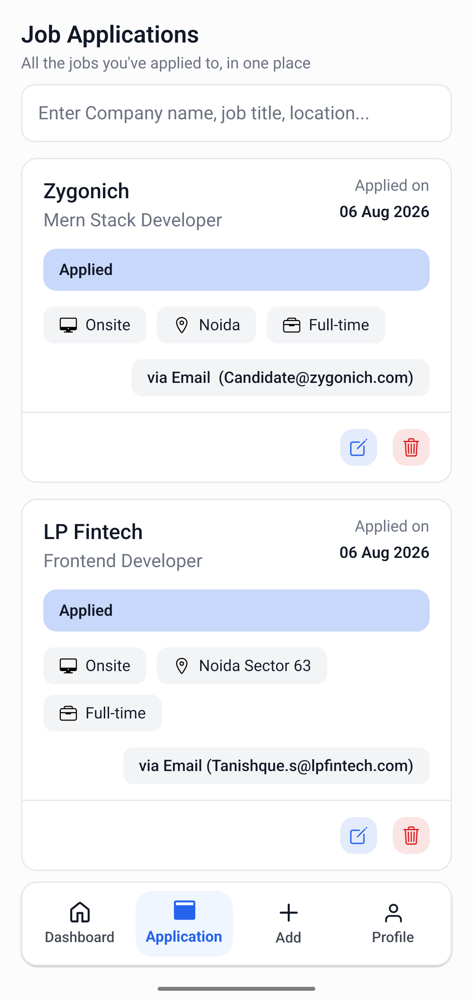
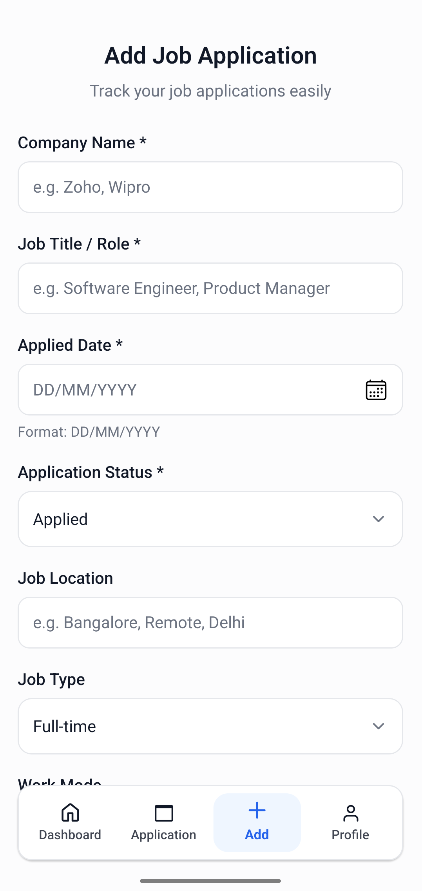
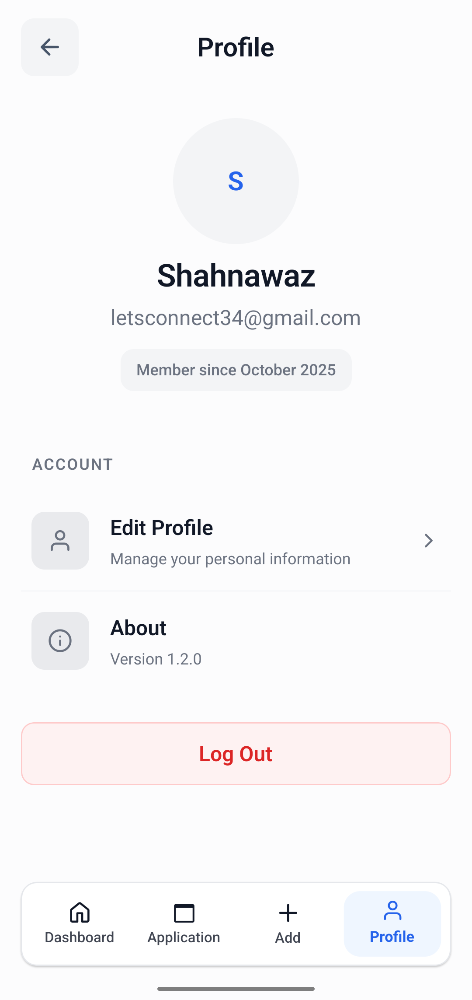
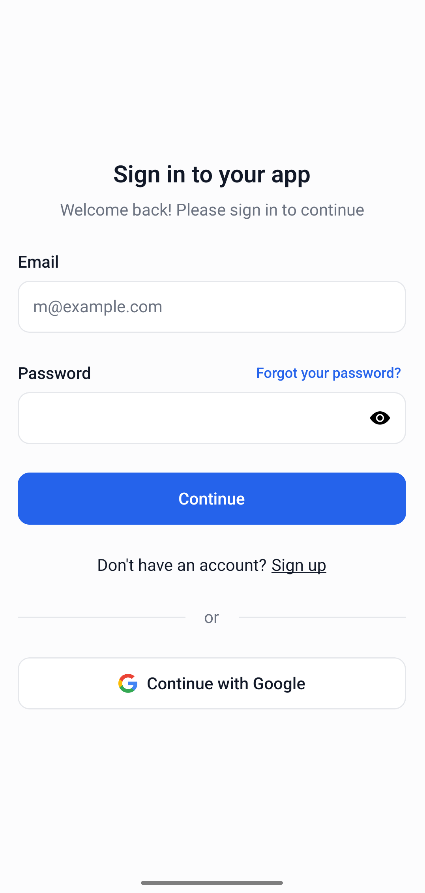

# 📋 Job Application Tracker

### Track applications • Stay organized • Land your next opportunity.

A modern mobile application built with **React Native (Expo)** and **Supabase**
to help applicants organize and manage their job search efficiently.

## 📖 About

Job Application Tracker is a mobile application that helps job seekers
manage every stage of their job search in one place.

Instead of maintaining spreadsheets, users can store all applications,
track interview progress, monitor offers and rejections, and analyze
their overall job search through interactive statistics and charts.

## ✨ Features

- 📊 Dashboard with real-time statistics
- 💼 Manage unlimited job applications
- 🔍 Search applications instantly
- 📈 Monthly analytics & charts
- 📞 Track HR calls & interviews
- 🎯 Success & Offer Rate calculations
- 📝 Edit & update applications
- 👤 User profile management
- 🔐 Secure authentication
- ☁️ Cloud synchronization with Supabase

## 📱 App Screenshots

| Dashboard                                                         | Analytics                                                         |
| ----------------------------------------------------------------- | ----------------------------------------------------------------- |
|  |  |

| Applications                                                         | Add Application                                                         |
| -------------------------------------------------------------------- | ----------------------------------------------------------------------- |
|  |  |

| Profile                                                         | Sign in                                                       |
| --------------------------------------------------------------- | ------------------------------------------------------------- |
|  |  |

## 🏗️ Architecture

The application follows a modern client-server architecture built with React Native and Supabase.

- 📱 **Frontend:** React Native (Expo) with TypeScript
- 🎨 **UI & Styling:** NativeWind (Tailwind CSS), RN Primitives, Lucide Icons
- 🧭 **Navigation:** Expo Router (File-based Routing)
- ☁️ **Backend:** Supabase
- 🗄️ **Database:** PostgreSQL (Managed by Supabase)
- 🔐 **Authentication:** Supabase Auth (Email/Password & Google Sign-In)
- 📝 **Forms & Validation:** React Hook Form with Yup
- 📊 **Data Visualization:** React Native Gifted Charts
- 💾 **Storage:** Expo Secure Store & AsyncStorage
- 🌐 **Network Monitoring:** React Native NetInfo

## 📥 Download

The application is currently **not available** on the Google Play Store or Apple App Store.

You can download the latest Android APK from the **GitHub Releases** page.

> Every release includes:
>
> - 📦 Latest APK
> - 📝 Release Notes
> - ✨ New Features
> - 🐞 Bug Fixes
> - ⚡ Performance Improvements

👉 **Download the latest APK here**

https://github.com/shahnawaz46/job-application-tracking/releases/latest

> **Note**
>
> iOS builds are not currently available.
> The app is planned for future release on both the **Google Play Store** and the **Apple App Store**.

## 🚀 Project Status

| Platform        | Status                           |
| --------------- | -------------------------------- |
| Android APK     | ✅ Available via GitHub Releases |
| Google Play     | 🚧 Planned                       |
| iOS             | 🚧 Planned                       |
| Apple App Store | 🚧 Planned                       |

Made with ❤️ for job seekers.

Track applications • Stay organized • Land your next opportunity

